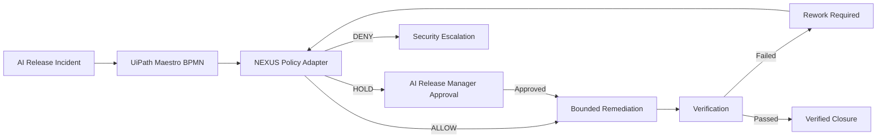

# NEXUS Sentinel Recovery

A governed AI-release incident recovery workflow for **UiPath AgentHack Track 2: Maestro BPMN**.

UiPath Automation Cloud is the control and execution plane. The NEXUS Sentinel Policy Adapter is a deterministic advisory service that evaluates release evidence, returns `ALLOW`, `HOLD`, or `DENY`, and emits an auditable case transition. It never performs remediation.

## Demonstrated Outcome

The reference case catches a model identity mismatch and incomplete evidence, holds privileged remediation for an AI Release Manager, verifies the remediation, reopens the case when the first verification fails, and closes only after every check passes.

## Architecture



## UiPath Components

- Maestro BPMN owns the process sequence, verdict gateways, approval step, remediation, verification, rework loop, and closure.
- The published BPMN contains deterministic verdict routing and an explicit approval task.
- UiPath Solutions Management packages and deploys the process.
- The approval User Task is modeled but is not yet bound to an Action App.
- Orchestrator exposes a successful per-node execution trace.
- UiPath for Coding Agents is used to validate the adapter contract and deployment package.

## Public API

| Method | Endpoint | Purpose |
|---|---|---|
| `GET` | `/health` | Dependency-free liveness contract |
| `POST` | `/api/v1/case/evaluate` | Evidence and policy evaluation |
| `POST` | `/api/v1/case/verify` | Post-remediation verification |
| `GET` | `/api/v1/audit/{audit_id}` | Sanitized audit outcome retrieval |

The adapter rejects unknown fields and retains only a SHA-256 input fingerprint plus the structured outcome. Replaying an identical `request_id` returns the original result; changing its payload returns HTTP `409`.

## Run Locally

```bash
python -m pip install -r requirements.txt
uvicorn nexus_uipath_bridge.app:app --host 127.0.0.1 --port 8080
python -m pytest -q
```

Port `8080` is the standalone demo default. Port `7352` remains reserved for the private NEXUS Brain API and is not used by this service.

## Container

```bash
docker build -t nexus-sentinel .
docker run --rm -p 8080:8080 nexus-sentinel
```

Deploy the container to a public HTTPS service, then configure `SENTINEL_BASE_URL` in the UiPath API Workflow. No NEXUS private service, model, database, or credential is required.

## Demo Assets

- `samples/01-safety-hold.json`: mismatch plus missing evidence.
- `samples/02-approved-remediation.json`: corrected identity and approved action.
- `samples/03-verification-failed.json`: first verification forces re-entry.
- `samples/04-verification-passed.json`: final closure gate.
- `uipath/NEXUSSentinelBPMN/Process.bpmn`: portable source corresponding to the published process.
- `UIPATH_BUILD_GUIDE.md`: exact Maestro BPMN tasks, gateways, and deployment steps.
- `DEMO_SCRIPT.md`: resettable five-minute presentation sequence.
- `SUBMISSION.md`: Devpost-ready copy.
- `PRESENTATION_OUTLINE.md`: slide-by-slide deck content.
- `PRODUCT_FEEDBACK.md`: evidence-backed UiPath product feedback and corrections.
- `JUDGE_MATRIX.md`: verified evidence mapped to the judging criteria.

## Presentation Deck
`nhttps://docs.google.com/presentation/d/16B00BABNwdsIpOygh_VtlineLtHP6P8VHPyjqxlnMP0/edit

## Safety Boundaries

- No local paths, secrets, prompts, model weights, or private NEXUS evidence are included.
- The adapter does not call Ollama, Brain API, GMR, or a GPU guard model.
- `selected_model` reports the observed and policy-accepted release model; it does not claim inference occurred.
- Policy outcomes are advisory. UiPath remains the authoritative orchestrator.
- Numerical security, savings, and automation-rate claims are intentionally omitted unless reproduced.

## License

Apache License 2.0. See `LICENSE`.
